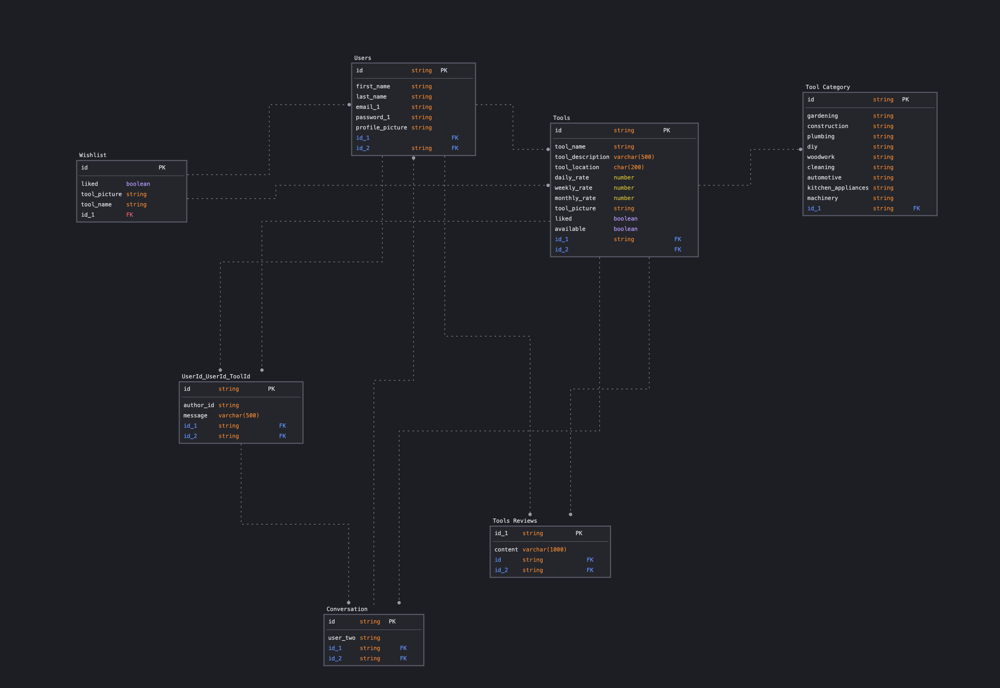

# FriendsWithTools

## Project description

C2C Tool renting app for neighbors

A tool renting app that allows users to upload the tools they own and offer them for rent, as well as view other user's tools and rent them.
The app will allow for payment transactions and messaging between users.

## MVP

- Users should be able to register, login and logout from the app.
- Users should be able to take a picture of their tool and list it for rent.
- Users should be able to search for available tools.
- Users should be able to place a request to rent a tool.
- Users that listed a tool for rent should be able to accept or deny rent requests.
- User should be able to make and receive payments for accepted rent requests.?

## Additional features

- Users should be able to message each other. (Socket io)
- Users should be able to review each other after returning the rented item. The reviews should be published only when both users have written them.
- Users should be able to see tools for rent as pins on a map near them. (Leaflet)

## Tech stack

Mobile first app.

**Front End:**

- React with Next.js and TypeScript
- FireBase for image storage
- Tailwind/Chakra/Shadcn/ui (tbd)
- Stripe for payments

**Back End:**

- Next.js
- Postgres with Prisma for user data storage
- Stripe for payments
- Socket io for messages between users
- NextAuth.js for authentication

**Database Structure:**

**Testing**

- Front end with Jest & Testing Library
- Back end with Jest and SuperTest
- E2E with Cypress

**Deployment**

- Vercel
